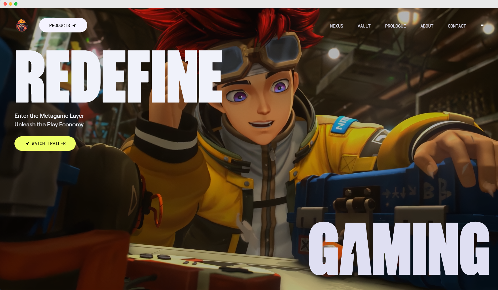

<h1 align="center"><b>🎮NOVA - 3D GAMING WEBSITE 💻</b></h1>



## ⚠️ Disclaimer

All design credits go to **[Zentry](https://zentry.com/)**. This project is created purely for **educational purposes** and is not intended for commercial use or public deployment.

## 🤖 Introduction

Build a visually captivating website inspired by **[Zentry](https://zentry.com/)**, featuring scroll-triggered animations, geometric transitions, and engaging video storytelling. Learn how to deliver a luxurious, modern feel, focusing on engaging UI/UX and smooth responsiveness, capturing the essence of what makes an Awwwards winner.

If you're getting started and need assistance or face any bugs, feel free to reach me out.

## ⚙️ Tech Stack

- **GSAP**
- **React.js**
- **Tailwind CSS**

## 🔋 Key Features

- [x] 📚 **Scroll-Based Animations**: Dynamic animations triggered by scrolling for a more engaging user experience.

- [x] ⚡ **Clip Path Shaped Animations**: Unique geometric transitions using CSS clip-paths to create visually stunning effects.

- [x] 🎨 **3D Hover Effects**: Interactive 3D transformations that respond to user interactions for a modern feel.

- [x] 📷 **Video Transitions**: Seamlessly integrated video elements to enhance storytelling and flow.

- [x] 🔗 **Smooth UI/UX**: Polished interfaces with buttery-smooth interactions for an intuitive user journey.

- [x] 🚀 **Completely Responsive**: Flawless adaptation across all devices, ensuring a consistent experience.

## 🛠️Getting Started

Follow these steps to set up the project locally on your machine.

**Prerequisites**

Make sure you have the following installed on your machine:

- [Git](https://git-scm.com/)
- [Node.js](https://nodejs.org/en)
- [npm](https://www.npmjs.com/) (Node Package Manager)

**Cloning the Repository**

```bash
git clone https://github.com/Sandhit06/AWWWARDS-Winning-Gaming-Website.git
cd AWWWARDS-Winning-Gaming-Website
```

**Installation**

Install the project dependencies using npm:

```bash
npm install
```

**Running the Project**

```bash
npm run dev
```

Open [http://localhost:5173](http://localhost:5173) in your browser to view the project.

## Still need help?
Open an issue on our GitHub repository, and we will help you as soon as possible.

Enjoy exploring and extending this project! Feel free to contribute and suggest improvements.

## Contact

If you want to contact me you can reach me at [Twitter](https://x.com/SandhitK).

## Developer
<table>
    <tr align="center">
        <td>
        Sandhit Karmakar
        <p align="center">
            
        </p>
            <p align="center">
                <a href = "https://github.com/Sandhit06">
                    
                </a>
                <a href = "https://www.linkedin.com/in/sandhit-karmakar/" target="_blank">
                    
                </a>
                <a href = "mailto:sandhitkarmakar@gmail.com" target="_blank">
                    
                </a>
            </p>
        </td>
    </tr>
</table>

<p align="center">
    Made with ❤️ by <a href="https://github.com/Sandhit06">Sandhit Karmakar</a>
</p>
